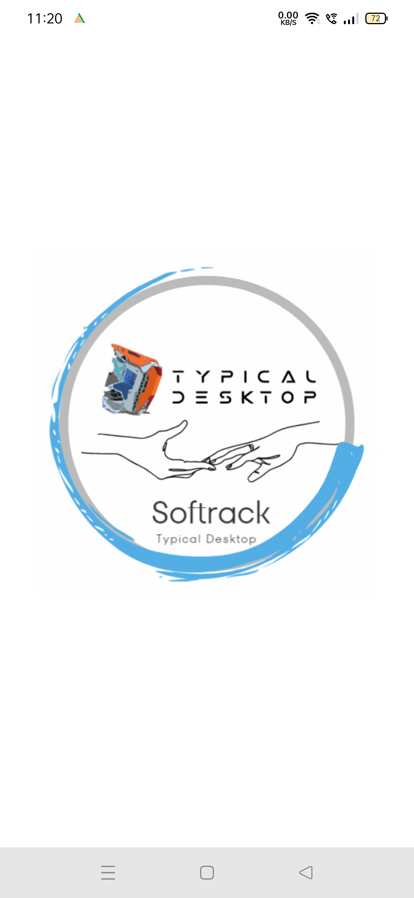
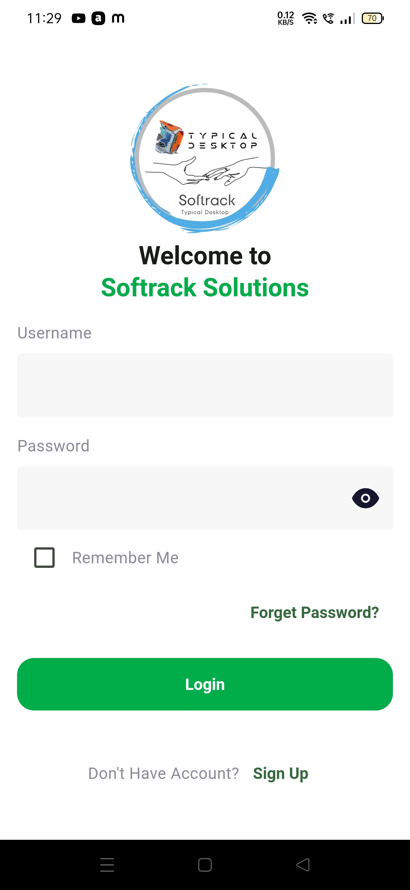
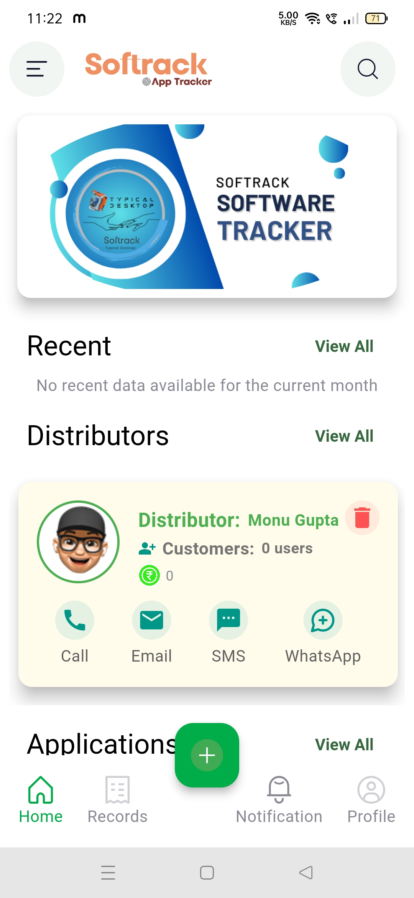
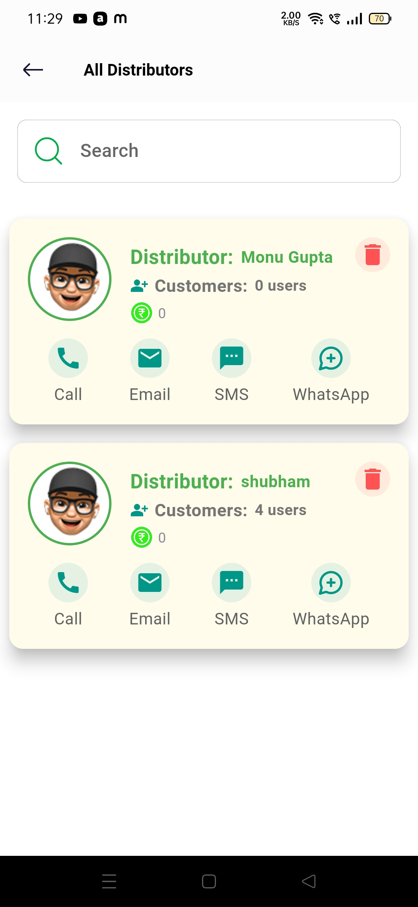
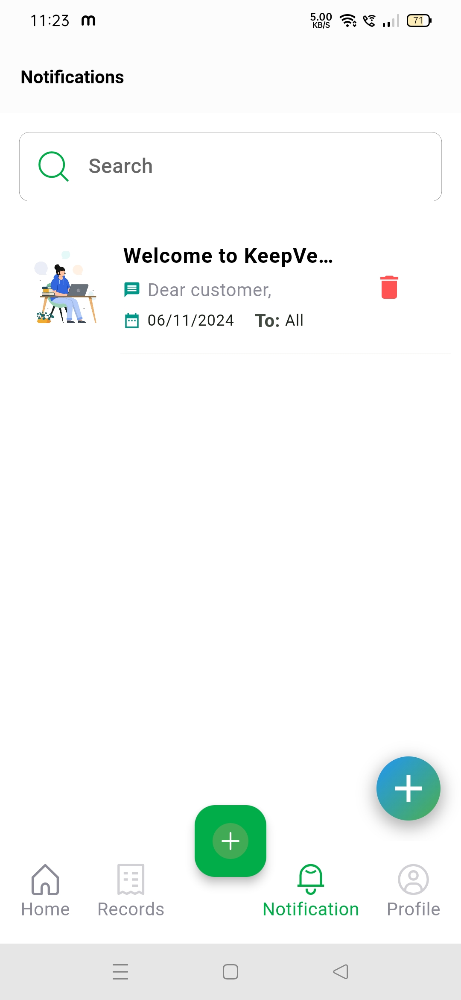
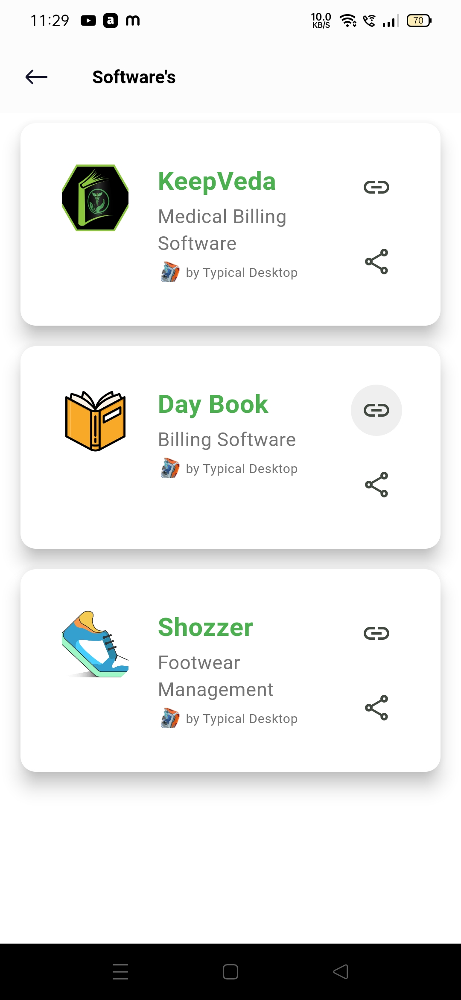

## **Softrack Solutions by Sumit Sunil Dubey**

**License management and Deployment app for Businesses**

**Project Name:** Softrack
**Portfolio Link:** [My Developer Portfolio](https://sumit-portfolio-4mn0.onrender.com/)

---

## **Index**

1. Project Overview
2. Problem Statement
3. Features Overview
4. Technical Stack
5. Development Challenges & Solutions
6. Learnings & Retrospective
7. Screenshots

---

## **1. Project Overview**

**Softrack** is a Flutter-based software deployment and license management app. It helps software vendors and distributors manage software keys, user access, and deployment duration through a centralized platform. It supports a hierarchical structure with admin and distributor roles, OTP-based user authentication, software update deployment, and customer notifications — all built on Supabase with a PostgreSQL backend.

---

## **2. Problem Statement**

The traditional methods of managing and distributing software (via spreadsheets or manual key sharing) lack scalability, security, and automation. Softrack addresses these challenges by offering:

* Automated license key generation
* Duration-based license control
* Role-based access for Admin and Distributors
* Built-in communication via notifications and in-app contact

---

## **3. Features Overview**

### **Admin Panel**

* Manage all distributors, customers, and software
* Add new software (EXE URL, title, logo, and description)
* Send notifications and service updates
* Set or modify license durations

### **Distributor Panel**

* Manage only their assigned customer accounts
* Contact admin directly within the app

### **Customer Management**

* Receive license keys via email
* Login/signup via OTP-based email verification
* Upgrade or renew services via app interface

---

## **4. Technical Stack**

* **Frontend:** Flutter (Dart)
* **Backend:** Supabase (PostgreSQL + RESTful API)
* **Authentication:** Supabase Auth with OTP (Email)
* **Database:** Supabase PostgreSQL
* **State Management:** Provider
* **Email Notifications:** Supabase functions and triggers
* **Deployment:** Custom REST API integration for software handling

---

## **5. Development Challenges & Solutions**

🔹 **OTP Email Verification**
*Challenge:* Ensuring secure and reliable OTP delivery.
*Solution:* Implemented Supabase Auth with email OTP, using Supabase functions and retry mechanisms for email reliability.

🔹 **Role-Based Access Control**
*Challenge:* Isolating data between admins and distributors.
*Solution:* Defined RLS (Row-Level Security) in Supabase with user role fields and custom access policies.

🔹 **Notification System**
*Challenge:* Delivering real-time, role-specific notifications.
*Solution:* Created server-side logic in Supabase with triggers and custom endpoints to send in-app messages and email alerts.

---

## **6. Learnings & Retrospective**

This project helped deepen my knowledge in:

* Scalable architecture with Supabase as BaaS
* Flutter + REST API integration best practices
* Designing modular user interfaces for different roles
* Security with Supabase RLS and OTP-based Auth

---

## **7. Screenshots**

You can see screenshots under each title:

| Splash Screen | Login Page with OTP | Home Screen | Distributor Panel | Notification Panel | Software Management |
| ------------- | ------------------- | ---------------- | ----------------- | ------------------ | ------------------- |
|  |  |  |  |  |  |

<!-- 
Author: Sumit Sunil Dubey
location: Thane
link: https://sumit-portfolio-4mn0.onrender.com/
 -->